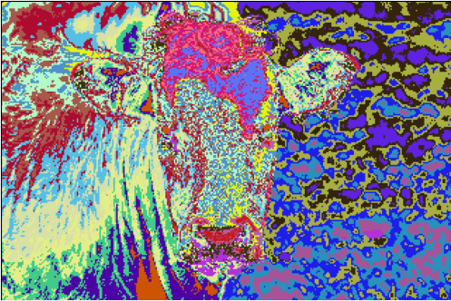
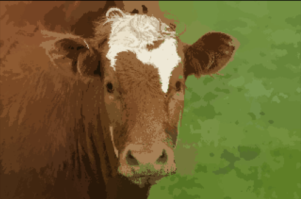
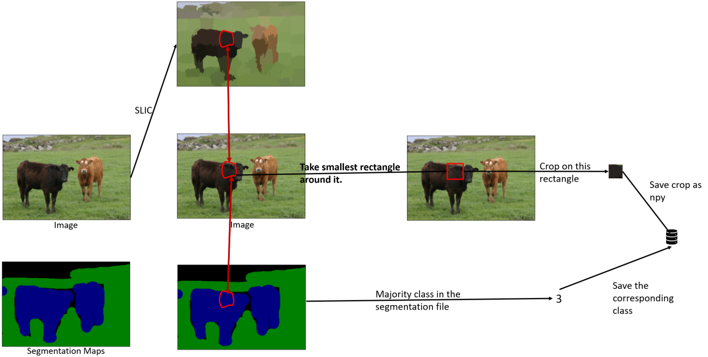

# Superpixel Clustering using KMeans and SLIC

A superpixel can be defined as a group of pixels that share common characteristics (like pixel intensity ). Superpixels are becoming useful in many Computer Vision and Image processing algorithms like Image Segmentation, Semantic labeling, Object detection and tracking etc because of the following-

-   They carry more information than pixels.
-   Superpixels have a perceptual meaning since pixels belonging to a given superpixel share similar visual properties.
-   They provide a convenient and compact representation of images that can be very useful for computationally demanding problems.

This project aims to generate superpixels from the [MSRCv1 dataset](http://download.microsoft.com/download/A/1/1/A116CD80-5B79-407E-B5CE-3D5C6ED8B0D5/msrc_objcategimagedatabase_v1.zip).
We implement superpixel clustering in the following ways : 

 1. KMeans clustering algorithm in the five dimensional RGB and XY space.
 2. Weighted KMeans algorithm with different weights for RGB and XY for each image.

  
   
 />
  

  <em> a) RGBXY clustering : Pixelwise class plot b) RGBXY clustering : Superpixel plot</em>
   

 

 4. Implementing the [SLIC algorithm](https://www.iro.umontreal.ca/~mignotte/IFT6150/Articles/SLIC_Superpixels.pdf) for improved superpixel generation.
 
 

  
  
  

  <em> a) SLIC clustering: Pixelwise class plot c) SLIC clustering: Superpixel plot</em>
   

# SLIC Superpixel classification network

  

This project aims at building a neural network in order to classify superpixels generated from the SLIC algorithm. These class labels can then be used to generate a semantic segmentation map of the image.

The dataset used for this project is the [MSRCv1 dataset](http://download.microsoft.com/download/A/1/1/A116CD80-5B79-407E-B5CE-3D5C6ED8B0D5/msrc_objcategimagedatabase_v1.zip).

  

The steps involved are as follows:

## Superpixel Generation

For each image :

- 100 superpixels were generated using the SLIC algorithm

- For each superpixel region, the best fitting rectangle is found and the region is dilated by 3 pixels.

- This region is extracted from the original image and saved as a npy file along with the class ID for that region.

## Superpixel Classification Network

A neural network was trained in PyTorch to classify each of the superpixels.

Network training definition :

- A standard VGG16 network with pretrained Imagenet weights was loaded.

- The last layer was removed a few linear layers were added to enable transfer learning.

- Cross entropy loss was as a loss function. Stochastic gradient descent with momentum was used as the optimizer.

The trained neural network then takes each superpixel patch as an input and outputs a class ID for it. This can be used to create a semantic segmentation of the input image.
